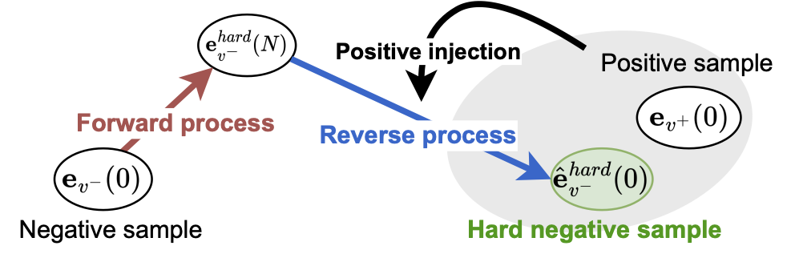

<div align=center>
<h1>SCONE: A Novel Stochastic Sampling to Generate Contrastive Views and Hard Negative Samples for Recommendation</h1>

 
 [](https://arxiv.org/abs/2405.00287) [](https://hits.seeyoufarm.com)

<div>
    <a href="https://scholar.google.com/citations?user=T1UHgUEAAAAJ&hl=en" target="_blank"><b>Chaejeong Lee</b></a><sup>1</sup>,
      <a href="https://www.jeongwhanchoi.com" target="_blank"><b>Jeongwhan Choi</b></a><sup>2*</sup>,
      <a href="https://scholar.google.co.kr/citations?user=-foMLcAAAAAJ&hl=en" target="_blank">Hyowon Wi</a><sup>3</sup>,
      <a href="https://scholar.google.com/citations?user=px5LGgMAAAAJ&hl=en" target="_blank">Sung-Bae Cho</a><sup>2</sup>,
      <a href="https://sites.google.com/view/noseong" target="_blank">Noseong Park</a><sup>3</sup>,
    <div>
     <sup>1</sup>Korea Telecom, <sup>2</sup>Yonsei University, <sup>3</sup>KAIST
    </div>
</div>
</div>

---

This is the official PyTorch implementation of the WSDM 2025 paper "SCONE: A Novel Stochastic Sampling to Generate Contrastive Views and Hard Negative Samples for Recommendation".

## TL;DR

<p align="center">

</p>

SCONE is a novel framework that:
- Generates dynamic contrastive views via stochastic sampling
- Creates diverse hard negative samples through stochastic positive injection
- Provides a unified solution for both data sparsity and negative sampling challenges


## Overall Framework

| A stochastic process for contrastive views generation |  A stochastic positive injection for hard negative samples generation |
| :-------------------------:|:-------------------------: |
|  |  |


> Stochastic Process for Contrastive Views (Left):
> - Forward process corrupts original embedding to generate noisy view
> - Reverse process generates new contrastive view from noisy embedding
> 
> Stochastic Positive Injection (Right):
> - Generates hard negative samples by injecting positive information during reverse process
> - Results in semantically meaningful negative samples
> 
> The overall architecture combines LightGCN for graph embedding with SGM for both contrastive learning and negative sampling tasks.

## Requirements
Run the following to install requirements:
```setup
conda env create --file environment.yml
```


## Quick Start
Train and evaluate SCONE:
```bash
python main.py --dataset_name douban --model SCONE --output_dir ./SCONE_exp/
```
- You can train our SCONE from scratch by run:

## Main Arguments
```
  --dataset_name: Dataset Name
  --model : Model Name
  --output_dir: Working directory
```

## Citation
If the code and paper are helpful for your work, please cite our paper:
```bibtex
@article{lee2024scone,
  title={Stochastic Sampling for Contrastive Views and Hard Negative Samples in Graph-based Collaborative Filtering},
  author={Lee, Chaejeong and Choi, Jeongwhan and Wi, Hyowon and Cho, Sung-Bae and Park, Noseong},
  journal={arXiv preprint arXiv:2405.00287},
  year={2024}
}
```